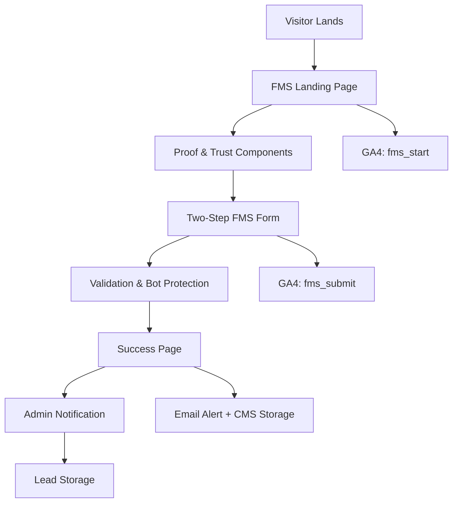
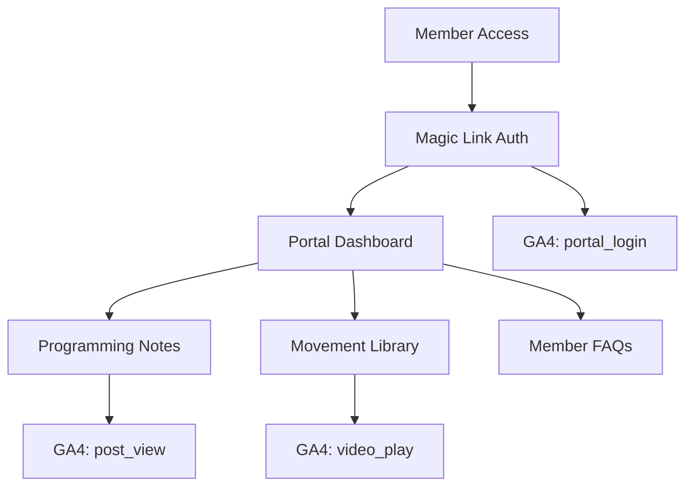
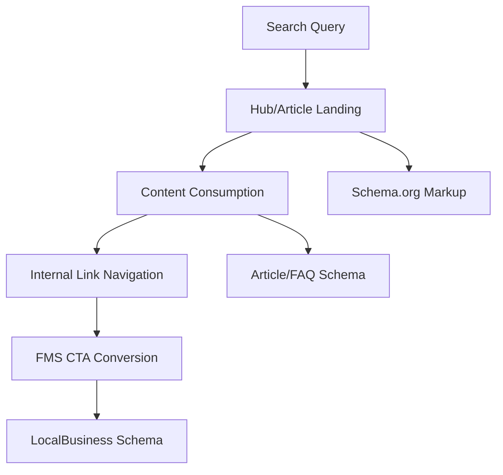

# GMC System Architecture Document

**Geelong Movement Co - CrossFit Gym MVP**

---

## 📋 Document Information

- **Project**: Geelong Movement Co (CrossFit + Physiotherapy) MVP Revamp
- **Version**: 1.0
- **Date**: September 13, 2025
- **Architect**: Winston (Solution Architect)
- **Status**: Technical Architecture Definition

---

## 🎯 Executive Summary

This document defines the comprehensive system architecture for the Geelong Movement Co MVP, a conversion-focused CrossFit gym website built on a modern, performant stack. The architecture prioritizes **FMS (Functional Movement Screen) conversion optimization**, **member retention**, and **local SEO excellence** while maintaining operational simplicity and cost efficiency.

### Key Architectural Principles

- **Conversion-First Design**: Every architectural decision optimized for FMS lead generation
- **Performance-Driven**: Core Web Vitals compliance (LCP <2.5s, CLS <0.1, INP <200ms)
- **Progressive Enhancement**: Mobile-first, accessible, SEO-optimized foundation
- **Developer Experience**: Modern tooling with type safety and automated workflows
- **Operational Simplicity**: Low-maintenance stack with minimal infrastructure complexity

---

## 🏗️ System Overview

### Technology Stack Architecture

```
┌─────────────────────────────────────────────────────────────────┐
│                        PRESENTATION LAYER                      │
├─────────────────────────────────────────────────────────────────┤
│ Next.js 14 (App Router) + React 18 + TypeScript               │
│ Tailwind CSS + shadcn/ui + Framer Motion                       │
│ NextAuth.js (Magic Links) + React Hook Form                    │
└─────────────────────────────────────────────────────────────────┘
           │
           ▼
┌─────────────────────────────────────────────────────────────────┐
│                        API & DATA LAYER                        │
├─────────────────────────────────────────────────────────────────┤
│ Next.js API Routes + Server Actions                            │
│ Sanity CMS (Content) + GROQ Queries                           │
│ Fitbox API (Timetable) + Tawk.to (Chat)                       │
└─────────────────────────────────────────────────────────────────┘
           │
           ▼
┌─────────────────────────────────────────────────────────────────┐
│                       HOSTING & ANALYTICS                      │
├─────────────────────────────────────────────────────────────────┤
│ Vercel (Hosting + CDN + Edge Functions)                        │
│ Google Analytics 4 + Google Search Console                     │
│ Vercel Analytics + Lighthouse CI                               │
└─────────────────────────────────────────────────────────────────┘
```

---

## 🔄 Data Flow Architecture

### Primary User Journeys & Data Flows

#### 1. FMS Conversion Funnel (Primary Revenue Driver)



#### 2. Member Portal Engagement Flow



#### 3. Content Discovery & SEO Flow



---

## 📁 Project Structure & Component Architecture

### Directory Architecture

```
app/
├── (routes)/
│   ├── page.tsx                    # Homepage
│   ├── fms/
│   │   ├── page.tsx                # FMS Landing
│   │   ├── success/page.tsx        # FMS Success
│   │   └── components/
│   │       └── fms-form.tsx        # Two-step form
│   ├── portal/
│   │   ├── page.tsx                # Portal dashboard
│   │   └── components/
│   │       ├── member-auth.tsx     # Magic link auth
│   │       ├── movement-library.tsx
│   │       └── member-faqs.tsx
│   ├── hubs/[slug]/page.tsx        # Condition hubs
│   ├── articles/[slug]/page.tsx    # Articles
│   └── timetable/page.tsx          # Timetable
├── components/
│   ├── ui/                         # shadcn/ui base components
│   ├── testimonials.tsx            # Proof components
│   ├── coach-bio.tsx
│   ├── safety-panel.tsx
│   ├── timetable.tsx               # Fitbox integration
│   ├── chat-toggle.tsx             # Tawk.to toggle
│   ├── analytics.tsx               # GA4 tracking
│   └── seo-head.tsx                # Schema markup
├── lib/
│   ├── sanity/
│   │   ├── client.ts               # Sanity configuration
│   │   ├── queries.ts              # GROQ queries
│   │   ├── schemas/                # Content schemas
│   │   └── types.ts                # Generated types
│   ├── auth.ts                     # NextAuth config
│   ├── gtag.ts                     # GA4 helpers
│   └── utils.ts                    # Utilities
└── api/
    ├── auth/                       # NextAuth routes
    ├── fms/submit/route.ts         # FMS form handler
    ├── revalidate/route.ts         # Sanity webhooks
    └── timetable/route.ts          # Fitbox proxy
```

### Component Hierarchy & Reusability

#### Atomic Design Pattern

```
Atoms (Base UI)
├── Button, Input, Label, Badge
├── Card, Skeleton, Alert
└── Typography components

Molecules (Feature Components)
├── FMS Form Steps
├── Video Player with captions
├── Testimonial Card
├── Coach Bio Card
└── FAQ Accordion

Organisms (Page Sections)
├── Hero Section with CTA
├── Proof Panel (testimonials + safety)
├── Timetable Grid
├── Movement Library Grid
└── Navigation with auth state

Templates (Page Layouts)
├── Marketing Layout (FMS, Home)
├── Content Layout (Hubs, Articles)
├── Portal Layout (Member area)
└── Form Layout (FMS form)

Pages (Route Components)
├── Homepage
├── FMS Landing & Success
├── Hub & Article pages
├── Portal Dashboard
└── Timetable page
```

---

## 🗄️ Content Management & Data Architecture

### Sanity CMS Schema Design

#### Core Content Types

```typescript
// schemas/documents/
export const contentSchemas = [
  // Primary content
  {
    name: 'article',
    type: 'document',
    fields: [
      'title',
      'slug',
      'excerpt',
      'content',
      'seo',
      'publishedAt',
      'author',
      'categories',
      'relatedHubs',
    ],
  },
  {
    name: 'conditionHub',
    type: 'document',
    fields: [
      'title',
      'slug',
      'condition',
      'symptoms',
      'dosAndDonts',
      'exercises',
      'faq',
      'relatedArticles',
    ],
  },

  // Trust & proof content
  {
    name: 'testimonial',
    type: 'document',
    fields: [
      'clientName',
      'content',
      'rating',
      'image',
      'program',
      'featured',
      'displayOrder',
    ],
  },
  {
    name: 'coachBio',
    type: 'document',
    fields: [
      'name',
      'title',
      'bio',
      'qualifications',
      'specialties',
      'image',
      'featured',
    ],
  },

  // Portal content
  {
    name: 'programmingNote',
    type: 'document',
    fields: ['week', 'title', 'content', 'movements', 'focus', 'publishedAt'],
  },
  {
    name: 'movementVideo',
    type: 'document',
    fields: [
      'name',
      'category',
      'description',
      'video',
      'captions',
      'difficulty',
      'equipment',
    ],
  },

  // Site configuration
  {
    name: 'siteSettings',
    type: 'document',
    fields: [
      'chatEnabled',
      'maintenanceMode',
      'fmsEnabled',
      'portalEnabled',
      'holidayMessage',
    ],
  },
]
```

#### Content Relationships & Internal Linking

```typescript
// Content relationship mapping for SEO internal linking
export const contentRelationships = {
  hubs: {
    linksTo: ['articles', 'fms', 'coaches'],
    linkedFrom: ['homepage', 'articles'],
  },
  articles: {
    linksTo: ['hubs', 'fms', 'portal'],
    linkedFrom: ['hubs', 'homepage'],
  },
  fms: {
    linksTo: ['coaches', 'safety'],
    linkedFrom: ['hubs', 'articles', 'homepage'],
  },
}
```

### GROQ Query Architecture

```typescript
// lib/sanity/queries.ts
export const queries = {
  // FMS landing optimized for conversion
  FMS_LANDING: `*[_type == "page" && slug.current == "fms"][0] {
    ...,
    testimonials[]-> {
      clientName, content, rating, program
    },
    coaches[]-> {
      name, title, image, qualifications[0..2]
    }
  }`,

  // Hub page with related content
  HUB_BY_SLUG: `*[_type == "conditionHub" && slug.current == $slug][0] {
    ...,
    relatedArticles[]-> {
      title, slug, excerpt
    },
    faq[] {
      question, answer
    }
  }`,

  // Portal dashboard for members
  PORTAL_DASHBOARD: `{
    "currentWeek": *[_type == "programmingNote"] | order(week desc)[0],
    "recentVideos": *[_type == "movementVideo"] | order(_createdAt desc)[0..5],
    "faqs": *[_type == "memberFaq"] | order(displayOrder asc)
  }`,
}
```

---

## 🔐 Authentication & Security Architecture

### NextAuth.js Configuration with Magic Links

```typescript
// lib/auth.ts
export const authConfig: NextAuthConfig = {
  providers: [
    EmailProvider({
      server: {
        host: process.env.EMAIL_SERVER_HOST,
        port: process.env.EMAIL_SERVER_PORT,
        auth: {
          user: process.env.EMAIL_SERVER_USER,
          pass: process.env.EMAIL_SERVER_PASSWORD,
        },
      },
      from: process.env.EMAIL_FROM,
    }),
  ],

  callbacks: {
    async signIn({ user, account, profile }) {
      // Verify member email against CMS member list
      const isMember = await verifyMemberEmail(user.email)
      return isMember
    },

    async session({ session, token }) {
      return {
        ...session,
        user: {
          ...session.user,
          isMember: true,
        },
      }
    },
  },

  pages: {
    signIn: '/portal/signin',
    verifyRequest: '/portal/verify',
  },
}
```

### Security Measures

```typescript
// Security implementation layers
export const securityConfig = {
  // Form protection
  formSecurity: {
    turnstile: process.env.TURNSTILE_SECRET_KEY,
    rateLimit: '5 submissions per 15 minutes',
    validation: 'server-side + client-side',
    sanitization: 'DOMPurify + server validation',
  },

  // Content security
  contentSecurity: {
    headers: 'Strict CSP headers',
    sanity: 'Read-only tokens for public content',
    preview: 'Authenticated preview mode only',
  },

  // Infrastructure security
  infrastructure: {
    vercel: 'Automatic HTTPS + edge protection',
    environment: 'Production secrets via Vercel env vars',
    monitoring: 'Error tracking + performance monitoring',
  },
}
```

---

## 🚀 Performance & Optimization Architecture

### Core Web Vitals Strategy

```typescript
// Performance optimization implementation
export const performanceStrategy = {
  // Largest Contentful Paint (LCP < 2.5s)
  lcp: {
    images: 'Next.js Image optimization + WebP/AVIF',
    fonts: 'Variable fonts with font-display: swap',
    criticalCSS: 'Inlined critical path CSS',
    serverRendering: 'App Router SSR for above-fold content',
  },

  // Cumulative Layout Shift (CLS < 0.1)
  cls: {
    images: 'Explicit width/height dimensions',
    fonts: 'Preloaded variable fonts',
    dynamicContent: 'Skeleton loading states',
    chat: 'No-shift Tawk.to integration',
  },

  // Interaction to Next Paint (INP < 200ms)
  inp: {
    hydration: 'Selective hydration strategies',
    codesplitting: 'Route-based + component-based splitting',
    stateManagement: 'Optimized React state patterns',
    formHandling: 'Debounced validation + progressive enhancement',
  },
}
```

### Caching & Data Fetching Strategy

```typescript
// Next.js caching strategy for different content types
export const cachingStrategy = {
  // Static content (long cache)
  static: {
    duration: '1 year',
    content: ['images', 'fonts', 'icons'],
    strategy: 'Vercel Edge CDN + immutable assets',
  },

  // Semi-static content (revalidate)
  semiStatic: {
    duration: '1 hour',
    content: ['articles', 'hubs', 'testimonials'],
    strategy: 'ISR with Sanity webhook revalidation',
  },

  // Dynamic content (no cache)
  dynamic: {
    duration: 'no-cache',
    content: ['portal dashboard', 'member content'],
    strategy: 'Server-side rendering per request',
  },

  // External APIs (custom cache)
  external: {
    fitbox: '15 minutes cache with stale-while-revalidate',
    timetable: 'Edge cached with manual purge capability',
  },
}
```

---

## 📊 Analytics & Monitoring Architecture

### GA4 Event Tracking Strategy

```typescript
// lib/gtag.ts - Comprehensive event tracking
export const analyticsEvents = {
  // Conversion funnel events
  conversion: {
    fms_start: 'User begins FMS form',
    fms_submit: 'User completes FMS form',
    fms_conversion: 'FMS lead converts to first session',
  },

  // Engagement events
  engagement: {
    portal_login: 'Member accesses portal',
    video_play: 'Movement video played',
    post_view: 'Article/hub page viewed',
    chat_open: 'Tawk.to chat initiated',
  },

  // Navigation events
  navigation: {
    cta_click: 'Any CTA button clicked',
    internal_link: 'Internal navigation link clicked',
    external_link: 'External link clicked',
  },
}

// Event parameters for segmentation
export const eventParameters = {
  page_type: 'homepage | fms | hub | article | portal',
  cta_variant: 'primary | secondary | proof | safety',
  form_step: 'step_1 | step_2 | success',
  content_category: 'shoulder | low_back | general',
  member_status: 'prospect | member | returning',
}
```

### Performance Monitoring

```typescript
// Monitoring and observability setup
export const monitoringConfig = {
  // Core Web Vitals monitoring
  webVitals: {
    lcp: 'Threshold: 2.5s | Alert: >3s',
    cls: 'Threshold: 0.1 | Alert: >0.15',
    inp: 'Threshold: 200ms | Alert: >300ms',
    reporting: 'Vercel Analytics + GA4 + Lighthouse CI',
  },

  // Error tracking
  errorTracking: {
    clientErrors: 'Error boundary + GA4 exception events',
    serverErrors: 'API route error handling + logging',
    formErrors: 'Validation error tracking',
    integrationErrors: 'Fitbox/Sanity API error monitoring',
  },

  // Business metrics
  businessMetrics: {
    conversionRate: 'FMS start → submit → first session',
    portalEngagement: 'Weekly active members',
    contentPerformance: 'Hub → FMS conversion rate',
    seoPerformance: 'Organic traffic → FMS conversion',
  },
}
```

---

## 🔌 Integration Architecture

### External API Integration Patterns

#### Fitbox Timetable Integration

```typescript
// api/timetable/route.ts
export async function GET() {
  try {
    // Primary: Fitbox API
    const fitboxData = await fetchFitboxTimetable()
    return NextResponse.json(fitboxData)
  } catch (error) {
    // Fallback: Sanity CMS
    const fallbackData = await sanityClient.fetch(TIMETABLE_FALLBACK_QUERY)
    return NextResponse.json({
      data: fallbackData,
      source: 'fallback',
      message: 'Using CMS fallback data',
    })
  }
}

// Caching strategy for timetable
const timetableCache = {
  duration: 900, // 15 minutes
  strategy: 'stale-while-revalidate',
  fallback: 'immediate CMS data',
}
```

#### Tawk.to Chat Integration

```typescript
// components/chat-toggle.tsx
export function ChatToggle() {
  const { data: settings } = useSanityQuery(SITE_SETTINGS_QUERY)

  useEffect(() => {
    if (settings?.chatEnabled && typeof window !== 'undefined') {
      // Load Tawk.to script dynamically to prevent CLS
      const script = document.createElement('script')
      script.async = true
      script.src = 'https://embed.tawk.to/...'
      script.onload = () => gtag('event', 'chat_loaded')
      document.head.appendChild(script)
    }
  }, [settings?.chatEnabled])

  return null // No UI, just script loading
}
```

#### Sanity Webhook Integration

```typescript
// api/revalidate/route.ts - Content revalidation
export async function POST(request: Request) {
  const { isValidSignature, body } = await validateSanityWebhook(request)

  if (!isValidSignature) {
    return new Response('Unauthorized', { status: 401 })
  }

  // Intelligent revalidation based on content type
  const revalidationMap = {
    article: ['/', '/articles', `/articles/${body.slug}`],
    conditionHub: ['/', '/hubs', `/hubs/${body.slug}`],
    testimonial: ['/', '/fms'],
    siteSettings: ['*'], // Revalidate all routes
  }

  const tags = revalidationMap[body._type] || []
  await Promise.all(tags.map(tag => revalidateTag(tag)))

  return NextResponse.json({ revalidated: true, tags })
}
```

---

## 📱 Mobile-First & Responsive Architecture

### Responsive Design Strategy

```typescript
// Tailwind breakpoint strategy aligned with user behavior
export const breakpointStrategy = {
  mobile: {
    range: '320px - 767px',
    priority: 'Primary development target',
    features: [
      'Touch-optimized forms',
      'Thumb-friendly CTAs',
      'Simplified navigation',
    ],
  },

  tablet: {
    range: '768px - 1023px',
    priority: 'Secondary optimization',
    features: ['Expanded content layout', 'Side-by-side components'],
  },

  desktop: {
    range: '1024px+',
    priority: 'Enhancement layer',
    features: ['Multi-column layouts', 'Hover states', 'Advanced interactions'],
  },
}

// Component responsive patterns
export const responsivePatterns = {
  navigation: 'Mobile: Hamburger → Tablet: Horizontal → Desktop: Mega menu',
  fmsForm:
    'Mobile: Single column → Tablet: Optimized spacing → Desktop: Side-by-side',
  timetable:
    'Mobile: Stacked cards → Tablet: 2-column grid → Desktop: Full grid',
  testimonials: 'Mobile: Single slide → Tablet: 2 slides → Desktop: 3 slides',
}
```

---

## 🔄 Development & Deployment Architecture

### Development Workflow

```typescript
// Development environment setup
export const devWorkflow = {
  // Local development
  local: {
    commands: ['npm run dev', 'npm run typegen', 'npm run lint'],
    services: ['Next.js dev server', 'Sanity Studio', 'TypeScript compiler'],
    ports: ['3000 (Next.js)', '3333 (Sanity Studio)'],
  },

  // Type generation workflow
  typeGeneration: {
    trigger: 'Schema changes or GROQ query updates',
    process: 'sanity schema extract → sanity typegen generate',
    integration: 'Pre-dev and pre-build hooks',
  },

  // Quality assurance
  qa: {
    linting: 'ESLint + Prettier + TypeScript strict mode',
    testing: 'Lighthouse CI + accessibility audits',
    validation: 'Schema validation + broken link checks',
  },
}
```

### Deployment Strategy

```typescript
// Vercel deployment configuration
export const deploymentConfig = {
  // Environment setup
  environments: {
    preview: 'Feature branches → Vercel preview URLs',
    staging: 'Main branch → staging.geelongmovement.co',
    production: 'Release tags → geelongmovement.co',
  },

  // Build optimization
  buildProcess: {
    typeGeneration: 'Pre-build Sanity type generation',
    optimization: 'Next.js build optimization + asset bundling',
    caching: 'Aggressive static asset caching',
  },

  // Rollback strategy
  rollback: {
    trigger: 'Core Web Vitals degradation or critical errors',
    process: 'One-click Vercel rollback to previous deployment',
    monitoring: 'Real-time error rate and performance monitoring',
  },
}
```

---

## 🎯 Success Metrics & KPI Architecture

### Technical Performance KPIs

```typescript
export const technicalKPIs = {
  performance: {
    lcp: 'Target: <2.5s | Current baseline: TBD',
    cls: 'Target: <0.1 | Current baseline: TBD',
    inp: 'Target: <200ms | Current baseline: TBD',
    uptime: 'Target: ≥99.9% | Monitoring: Vercel + external',
  },

  conversion: {
    fmsStartRate: 'FMS page visits → form start %',
    fmsCompletionRate: 'Form start → submission %',
    fmsConversionRate: 'Submission → first session %',
    timeToFirstSession: 'Target: ≤5 days median',
  },

  engagement: {
    portalActiveUsers: 'Target: ≥40% weekly active members',
    videoPlayRate: 'Movement library engagement %',
    contentDepth: 'Pages per session from organic traffic',
    chatUtilization: 'Chat open rate and response time',
  },
}
```

### Business Impact Tracking

```typescript
export const businessMetrics = {
  leadGeneration: {
    baseline: 'Week 1 FMS submissions',
    target: '+50% FMS leads by Week 4',
    measurement: 'GA4 events + CMS lead tracking',
  },

  memberRetention: {
    portalUsage: 'Weekly active member percentage',
    contentConsumption: 'Video plays + article views',
    sessionStickiness: 'Average portal session duration',
  },

  seoPerformance: {
    organicTraffic: 'Target: ≥20% organic traffic mix',
    hubPerformance: 'Condition hub → FMS conversion rate',
    localSeo: 'Google Business Profile action increase',
  },
}
```

---

## 🔮 Future Architecture Considerations

### Post-MVP Enhancement Architecture

```typescript
export const futureEnhancements = {
  // Phase 2: Booking Integration
  bookingIntegration: {
    trigger: 'FMS conversion rate validation',
    technology: 'Cliniko API integration',
    impact: 'Reduced time-to-first-session',
  },

  // Phase 3: Payment Processing
  payments: {
    trigger: 'Intro offer validation',
    technology: 'Stripe integration with Next.js',
    features: ['Trial bookings', 'Membership packages', 'Payment links'],
  },

  // Phase 4: Advanced Portal
  advancedPortal: {
    trigger: 'Member engagement metrics validation',
    features: ['PR tracking', 'Member messaging', 'Progress photos'],
    technology: 'Extended Sanity schemas + real-time features',
  },
}
```

### Scalability Architecture

```typescript
export const scalabilityConsiderations = {
  // Traffic scaling
  trafficScaling: {
    vercelLimits: 'Enterprise plan for high traffic',
    cdnStrategy: 'Global edge caching for media assets',
    databaseScaling: 'Sanity plan upgrades for content volume',
  },

  // Feature scaling
  featureScaling: {
    multiLocation: 'Multi-tenant architecture for gym expansion',
    api: 'RESTful API layer for mobile app integration',
    integrations: 'Standardized webhook patterns for new services',
  },

  // Team scaling
  teamScaling: {
    contentWorkflow: 'Editorial workflow with approval gates',
    development: 'Component library + design system',
    monitoring: 'Advanced alerting and dashboard setup',
  },
}
```

---

## 📋 Architecture Decision Records (ADRs)

### ADR-001: Next.js App Router over Pages Router

**Decision**: Use Next.js 14 App Router for new project
**Rationale**: Better TypeScript integration, improved performance, built-in layouts, simplified data fetching
**Consequences**: Modern development experience, better Core Web Vitals, learning curve for team

### ADR-002: Sanity CMS over Headless Alternatives

**Decision**: Use Sanity CMS for content management
**Rationale**: Excellent Next.js integration, flexible schema design, real-time collaboration, visual editing
**Consequences**: Content team efficiency, developer experience, subscription cost consideration

### ADR-003: NextAuth.js Magic Links over Complex Auth

**Decision**: Implement magic link authentication for member portal
**Rationale**: Simple user experience, no password management, secure, aligns with MVP scope
**Consequences**: Reduced friction for members, email dependency, simpler implementation

### ADR-004: Vercel Hosting over Self-Managed Infrastructure

**Decision**: Use Vercel for hosting and deployment
**Rationale**: Seamless Next.js integration, global CDN, automatic scaling, minimal ops overhead
**Consequences**: Excellent performance, simplified deployment, vendor lock-in consideration

---

## 🎯 Conclusion & Next Steps

This architecture document provides a comprehensive foundation for the GMC MVP development. The design prioritizes **conversion optimization**, **performance excellence**, and **operational simplicity** while maintaining flexibility for future enhancements.

### ✅ Completed Foundation (via v0 AI Generation)

1. ✅ **Environment Setup**: Next.js 14 + TypeScript + shadcn/ui fully configured
2. ✅ **Repository Setup**: Modern development environment with App Router
3. ✅ **Component Library**: Complete shadcn/ui implementation + custom components
4. ✅ **Page Architecture**: Home, FMS, Portal, Timetable pages built with responsive design
5. ✅ **Analytics Integration**: GA4 events configured and schema markup implemented

### Immediate Next Steps (Week 1-2)

1. **Backend APIs**: FMS form submission endpoint + email notification system
2. **Navigation**: Header/footer components for site-wide user flow
3. **Sanity CMS**: Workspace setup + schema design for content management
4. **Deployment**: Vercel production environment with environment variables
5. **Content Integration**: Replace hardcoded data with dynamic CMS content

### Architecture Validation

- **Performance Baseline**: Lighthouse CI setup for Core Web Vitals monitoring
- **Security Review**: Implementation of security measures and audit trails
- **Integration Testing**: Fitbox API connection + Sanity webhook validation
- **Accessibility Audit**: WCAG 2.1 AA compliance verification

This architecture serves as the technical foundation for achieving the GMC business objectives: **+50% FMS leads**, **≥40% member portal engagement**, and **≥99.9% uptime** while maintaining exceptional user experience and developer productivity.

---

_Architecture Document maintained by Winston (Solution Architect)_  
_Last updated: September 13, 2025_
