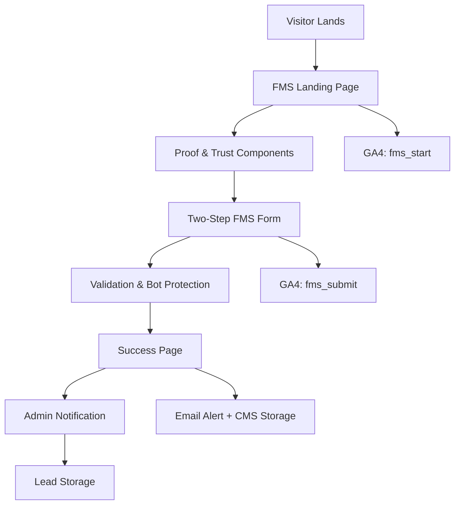
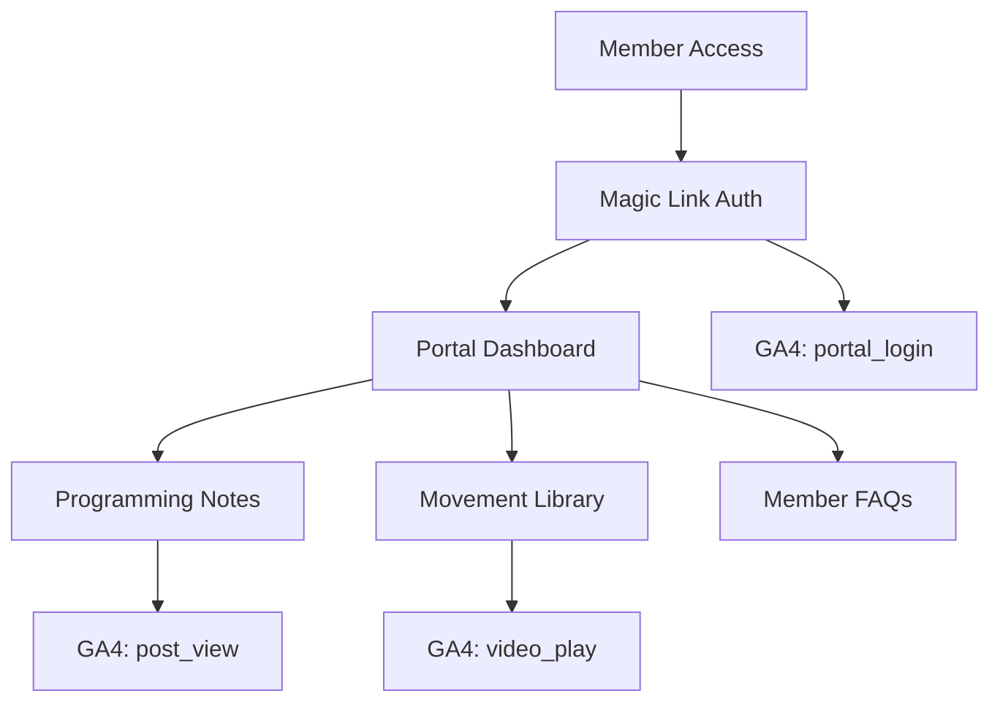
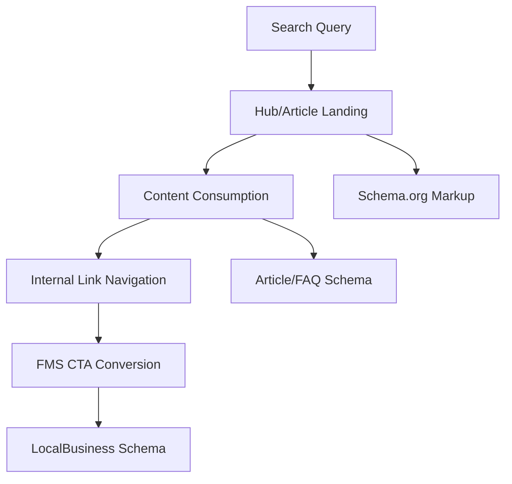

# 🔄 Data Flow Architecture

### Primary User Journeys & Data Flows

#### 1. FMS Conversion Funnel (Primary Revenue Driver)

#### 2. Member Portal Engagement Flow

#### 3. Content Discovery & SEO Flow

---
